<br/><div align="center">

# 🔷 RetroC


### *Solidity Contract Generator for the Modern Developer*


[](https://github.com/yourusername/retroc/releases)
[](LICENSE)
[](https://code.visualstudio.com/)
[](https://soliditylang.org/)
[](https://github.com/VishalNandy17/retroc/stargazers)

<p align="center">
  
</p>

<p align="center">
  
</p>

**[Installation](#-installation) • [Quick Start](#-quick-start) • [Templates](#-available-templates) • [Documentation](#-documentation) • [Contributing](#-contributing)**

---

</div>

<br/>

## 🎯 What is RetroC?

<div align="center">

</div>

<br/>

<table>
<tr>
<td width="50%">

### The Problem 😓
- Writing boilerplate code is time-consuming
- Copy-pasting from old projects introduces bugs
- Security patterns are easy to miss
- Test setup takes forever
- Keeping up with standards is exhausting

</td>
<td width="50%">

### The Solution ✨
- **Generate contracts in seconds**
- **Battle-tested templates** with best practices
- **Built-in security patterns** from day one
- **Automatic test scaffolding**
- **Always up-to-date** with latest standards

</td>
</tr>
</table>

<br/>

<div align="center">

## 🚀 Features That Make You Go "Wow!"

</div>

<br/>

<table>
<tr>
<td align="center" width="33%">


### ⚡ Lightning Fast
Generate complete contracts in **< 2 seconds**. Command palette integration means zero friction.

</td>
<td align="center" width="33%">


### 🛡️ Security First
Built on OpenZeppelin standards with audited patterns. Sleep better at night.

</td>
<td align="center" width="33%">


### 🧪 Test Ready
Auto-generate Hardhat or Foundry tests. Start testing immediately.

</td>
</tr>
<tr>
<td align="center">


### 🎨 Smart Placeholders
Intelligent variable replacement. Just fill in the blanks.

</td>
<td align="center">


### 📚 Standards Compliant
ERC20, ERC721, ERC1155, and more. Always following the latest ERCs.

</td>
<td align="center">


### ⚙️ Highly Configurable
Customize everything. Make it yours with extensive settings.

</td>
</tr>
</table>

<br/>

---

<br/>

<div align="center">

## 🛠️ Tech Stack


<br/><br/>

### Powered By Industry Leaders

</div>

<table>
<thead>
<tr>
<th align="center">Technology</th>
<th align="center">Purpose</th>
<th align="center">Why We Chose It</th>
</tr>
</thead>
<tbody>
<tr>
<td align="center">

</td>
<td>Extension Framework</td>
<td>Native integration, powerful APIs</td>
</tr>
<tr>
<td align="center">

</td>
<td>Type-Safe Development</td>
<td>Catch errors before runtime</td>
</tr>
<tr>
<td align="center">

</td>
<td>Smart Contract Language</td>
<td>Industry standard for EVM</td>
</tr>
<tr>
<td align="center">

</td>
<td>Runtime Environment</td>
<td>Fast, scalable, reliable</td>
</tr>
<tr>
<td align="center">

</td>
<td>Module Bundler</td>
<td>Optimized bundle size</td>
</tr>
<tr>
<td align="center">

</td>
<td>Testing Framework</td>
<td>Comprehensive test coverage</td>
</tr>
</tbody>
</table>

<br/>

---

<br/>

<div align="center">

## 📦 Installation

</div>

### 🎯 Method 1: VS Code Marketplace (Recommended)

```mermaid
graph LR
    A[Open VS Code] --> B[Press Ctrl+Shift+X]
    B --> C[Search 'RetroC']
    C --> D[Click Install]
    D --> E[🎉 Ready to Go!]
    style E fill:#10b981,stroke:#059669,stroke-width:2px,color:#fff
```



<details>
<summary><b>📝 Step-by-Step Instructions</b></summary>

1. Launch **Visual Studio Code**
2. Open Extensions panel: `Ctrl+Shift+X` (Windows/Linux) or `Cmd+Shift+X` (Mac)
3. Type **"RetroC"** in the search bar
4. Click the **Install** button
5. Reload VS Code if prompted
6. You're ready! 🚀

</details>

<br/>

### 🎯 Method 2: Install from VSIX

```bash
# Download the latest release
wget https://github.com/yourusername/retroc/releases/latest/download/retroc-1.0.0.vsix

# Install via command line
code --install-extension retroc-1.0.0.vsix
```

<br/>

### 🎯 Method 3: Build from Source

```bash
# Clone the repository
git clone https://github.com/yourusername/retroc.git && cd retroc

# Install dependencies
npm install

# Build the extension
npm run compile

# Package it
npm run package

# Install locally
code --install-extension retroc-1.0.0.vsix
```

<br/>

---

<br/>

<div align="center">

## 🚀 Quick Start

### *From Zero to Hero in 60 Seconds*

</div>

<br/>

### 🎬 Your First Contract

```mermaid
sequenceDiagram
    participant User
    participant RetroC
    participant VSCode
    
    User->>VSCode: Ctrl+Shift+P
    VSCode->>RetroC: Open Command Palette
    User->>RetroC: > Generate ERC20 Template
    RetroC->>User: 📝 Enter Token Name?
    User->>RetroC: MyAwesomeToken
    RetroC->>User: 🔤 Enter Symbol?
    User->>RetroC: MAT
    RetroC->>VSCode: ✨ Generate Contract
    VSCode->>User: 🎉 MyAwesomeToken.sol created!
```



<br/>

<table>
<tr>
<td width="60%">

### 1️⃣ Open Command Palette

Press `Ctrl+Shift+P` (Windows/Linux) or `Cmd+Shift+P` (Mac)

### 2️⃣ Choose Your Template

Type: `> Generate ERC20 Template`

### 3️⃣ Fill in the Details

- **Token Name**: `MyAwesomeToken`
- **Symbol**: `MAT`
- **Initial Supply**: `1000000`
- **Decimals**: `18`

### 4️⃣ Done! 🎉

Your contract is ready at `contracts/MyAwesomeToken.sol`

</td>
<td width="40%">

```solidity
// SPDX-License-Identifier: MIT
pragma solidity ^0.8.20;

import "@openzeppelin/contracts/token/ERC20/ERC20.sol";
import "@openzeppelin/contracts/access/Ownable.sol";

contract MyAwesomeToken is ERC20, Ownable {
    constructor() 
        ERC20("MyAwesomeToken", "MAT") 
    {
        _mint(msg.sender, 1000000 * 10 ** decimals());
    }
    
    function mint(address to, uint256 amount) 
        public 
        onlyOwner 
    {
        _mint(to, amount);
    }
}
```

</td>
</tr>
</table>

<br/>

---

<br/>

<div align="center">

## 📚 Available Templates

### *Production-Ready Contracts at Your Fingertips*

</div>

<br/>

<table>
<tr>
<td align="center" width="25%">


### ERC20 Token

**Fungible Tokens**

✅ Mintable  
✅ Burnable  
✅ Pausable  
✅ Permit (EIP-2612)  
✅ Access Control  

`> Generate ERC20 Template`

</td>
<td align="center" width="25%">


### ERC721 NFT

**Non-Fungible Tokens**

✅ Enumerable  
✅ URI Storage  
✅ Burnable  
✅ Royalties (EIP-2981)  
✅ Batch Minting  

`> Generate ERC721 Template`

</td>
<td align="center" width="25%">


### ERC1155 Multi

**Multi-Token Standard**

✅ Multiple Types  
✅ Batch Operations  
✅ URI Management  
✅ Supply Tracking  
✅ Gas Efficient  

`> Generate ERC1155 Template`

</td>
<td align="center" width="25%">


### DAO Governance

**Decentralized Autonomous Organization**

✅ Proposals  
✅ Voting System  
✅ Timelock  
✅ Quorum Rules  
✅ Token Gating  

`> Generate DAO Template`

</td>
</tr>
<tr>
<td align="center">


### Multisig Wallet

**Multi-Signature Wallet**

✅ Multiple Signers  
✅ Proposals  
✅ Threshold Config  
✅ Emergency Stop  
✅ Event Logging  

`> Generate Multisig Template`

</td>
<td align="center">


### Staking Contract

**Token Staking System**

✅ Stake/Unstake  
✅ Rewards  
✅ Lock Periods  
✅ APY Calculation  
✅ Emergency Exit  

`> Generate Staking Template`

</td>
<td align="center">


### Vesting Contract

**Token Vesting Schedule**

✅ Linear Vesting  
✅ Cliff Period  
✅ Multiple Recipients  
✅ Revocable  
✅ Batch Release  

`> Generate Vesting Template`

</td>
<td align="center">


### Custom Template

**Coming Soon!**

✅ Your Ideas  
✅ Community Driven  
✅ Plugin System  
✅ Template Store  
✅ Share & Earn  

`> Generate Custom Template`

</td>
</tr>
</table>

<br/>

<details>
<summary><b>🔍 View ERC20 Template Details</b></summary>

<br/>

### ERC20 Token - Full Feature Set

```solidity
// SPDX-License-Identifier: MIT
pragma solidity ^0.8.20;

import "@openzeppelin/contracts/token/ERC20/ERC20.sol";
import "@openzeppelin/contracts/token/ERC20/extensions/ERC20Burnable.sol";
import "@openzeppelin/contracts/token/ERC20/extensions/ERC20Pausable.sol";
import "@openzeppelin/contracts/access/AccessControl.sol";
import "@openzeppelin/contracts/token/ERC20/extensions/ERC20Permit.sol";

contract {{TOKEN_NAME}} is ERC20, ERC20Burnable, ERC20Pausable, AccessControl, ERC20Permit {
    bytes32 public constant MINTER_ROLE = keccak256("MINTER_ROLE");
    bytes32 public constant PAUSER_ROLE = keccak256("PAUSER_ROLE");

    constructor() ERC20("{{TOKEN_NAME}}", "{{TOKEN_SYMBOL}}") ERC20Permit("{{TOKEN_NAME}}") {
        _grantRole(DEFAULT_ADMIN_ROLE, msg.sender);
        _grantRole(MINTER_ROLE, msg.sender);
        _grantRole(PAUSER_ROLE, msg.sender);
        
        _mint(msg.sender, {{INITIAL_SUPPLY}} * 10 ** decimals());
    }

    function mint(address to, uint256 amount) public onlyRole(MINTER_ROLE) {
        _mint(to, amount);
    }

    function pause() public onlyRole(PAUSER_ROLE) {
        _pause();
    }

    function unpause() public onlyRole(PAUSER_ROLE) {
        _unpause();
    }

    function _update(address from, address to, uint256 value)
        internal
        override(ERC20, ERC20Pausable)
    {
        super._update(from, to, value);
    }
}
```

**Included Features:**
- ✨ Minting functionality with role-based access
- 🔥 Token burning capabilities
- ⏸️ Pausable transfers for emergency situations
- 📝 Permit function for gasless approvals (EIP-2612)
- 🔐 Role-based access control
- 💯 Full OpenZeppelin v5.0 compatibility

</details>

<br/>

---

<br/>

<div align="center">

## 🎮 Command Reference

### *All Commands at Your Fingertips*

</div>

<br/>

| 🎯 Command | 📝 Description | ⌨️ Default Keybinding |
|:-----------|:--------------|:---------------------|
| `RetroC: Generate ERC20 Template` | Create a new ERC20 token contract | `Ctrl+Alt+R E` |
| `RetroC: Generate ERC721 Template` | Create a new ERC721 NFT contract | `Ctrl+Alt+R N` |
| `RetroC: Generate ERC1155 Template` | Create a new ERC1155 multi-token | `Ctrl+Alt+R M` |
| `RetroC: Generate DAO Template` | Create a DAO governance contract | `Ctrl+Alt+R D` |
| `RetroC: Generate Multisig Template` | Create a multisig wallet | `Ctrl+Alt+R W` |
| `RetroC: Generate Staking Template` | Create a staking contract | `Ctrl+Alt+R S` |
| `RetroC: Generate Vesting Template` | Create a vesting contract | `Ctrl+Alt+R V` |
| `RetroC: Generate Test File` | Generate test scaffold for current contract | `Ctrl+Alt+R T` |
| `RetroC: Generate All Tests` | Generate tests for all contracts | `Ctrl+Alt+R A` |
| `RetroC: Open Settings` | Open RetroC configuration | `Ctrl+Alt+R C` |

<br/>

> 💡 **Pro Tip**: You can customize all keybindings in VS Code's Keyboard Shortcuts (`Ctrl+K Ctrl+S`)

<br/>

---

<br/>

<div align="center">

## ⚙️ Configuration

### *Make RetroC Truly Yours*

</div>

<br/>

### 📝 Settings File (`settings.json`)

```jsonc
{
  // 🔧 Core Settings
  "retroc.defaultSolidityVersion": "0.8.20",        // Solidity compiler version
  "retroc.defaultLicense": "MIT",                   // SPDX license identifier
  "retroc.openZeppelinVersion": "5.0.0",           // OpenZeppelin contracts version
  
  // 🧪 Testing Configuration
  "retroc.autoGenerateTests": true,                 // Auto-generate test files
  "retroc.testFramework": "hardhat",                // hardhat | foundry
  "retroc.useTypeScript": true,                     // Use TypeScript for tests
  
  // 📁 Directory Structure
  "retroc.contractsDirectory": "contracts",         // Output directory for contracts
  "retroc.testsDirectory": "test",                  // Output directory for tests
  "retroc.scriptsDirectory": "scripts",             // Output directory for scripts
  
  // 🎨 Code Style
  "retroc.indentSize": 4,                          // Spaces per indent level
  "retroc.useSpaces": true,                         // Spaces vs tabs
  "retroc.addComments": true,                       // Include explanatory comments
  "retroc.importStyle": "named",                    // named | default
  
  // 🔐 Security Features
  "retroc.includeReentrancyGuard": true,           // Add ReentrancyGuard
  "retroc.includePausable": true,                   // Add Pausable functionality
  "retroc.includeAccessControl": true,              // Add AccessControl
  
  // 🚀 Advanced Options
  "retroc.enableGasOptimizations": true,            // Include gas optimizations
  "retroc.includeNatSpec": true,                    // Add NatSpec documentation
  "retroc.deploymentScripts": true,                 // Generate deployment scripts
  "retroc.generateReadme": true                     // Generate contract README
}
```

<br/>

<details>
<summary><b>📖 Detailed Configuration Guide</b></summary>

<br/>

### Core Settings

| Setting | Type | Default | Description |
|---------|------|---------|-------------|
| `defaultSolidityVersion` | `string` | `"0.8.20"` | Solidity compiler version for generated contracts |
| `defaultLicense` | `string` | `"MIT"` | SPDX license identifier (MIT, Apache-2.0, GPL-3.0, etc.) |
| `openZeppelinVersion` | `string` | `"5.0.0"` | OpenZeppelin contracts library version |

### Testing Configuration

| Setting | Type | Default | Description |
|---------|------|---------|-------------|
| `autoGenerateTests` | `boolean` | `true` | Automatically generate test files with contracts |
| `testFramework` | `string` | `"hardhat"` | Testing framework (hardhat/foundry) |
| `useTypeScript` | `boolean` | `true` | Generate TypeScript test files |

### Security Features

| Setting | Type | Default | Description |
|---------|------|---------|-------------|
| `includeReentrancyGuard` | `boolean` | `true` | Add reentrancy protection |
| `includePausable` | `boolean` | `true` | Add pause/unpause functionality |
| `includeAccessControl` | `boolean` | `true` | Add role-based access control |

</details>

<br/>

---

<br/>

<div align="center">

## 🧪 Testing

</div>

<br/>

### 🎯 Test Generation

RetroC automatically generates comprehensive test suites:


<br/>

### 📝 Example Generated Test (Hardhat + TypeScript)

```typescript
import { expect } from "chai";
import { ethers } from "hardhat";
import { MyAwesomeToken } from "../typechain-types";
import { SignerWithAddress } from "@nomiclabs/hardhat-ethers/signers";

describe("MyAwesomeToken", function () {
  let token: MyAwesomeToken;
  let owner: SignerWithAddress;
  let addr1: SignerWithAddress;
  let addr2: SignerWithAddress;

  beforeEach(async function () {
    [owner, addr1, addr2] = await ethers.getSigners();
    
    const Token = await ethers.getContractFactory("MyAwesomeToken");
    token = await Token.deploy();
    await token.deployed();
  });

  describe("Deployment", function () {
    it("Should set the right owner", async function () {
      expect(await token.owner()).to.equal(owner.address);
    });

    it("Should assign the total supply to the owner", async function () {
      const ownerBalance = await token.balanceOf(owner.address);
      expect(await token.totalSupply()).to.equal(ownerBalance);
    });
  });

  describe("Transactions", function () {
    it("Should transfer tokens between accounts", async function () {
      await token.transfer(addr1.address, 50);
      expect(await token.balanceOf(addr1.address)).to.equal(50);
    });

    it("Should fail if sender doesn't have enough tokens", async function () {
      const initialOwnerBalance = await token.balanceOf(owner.address);
      await expect(
        token.connect(addr1).transfer(owner.address, 1)
      ).to.be.revertedWith("ERC20: transfer amount exceeds balance");
    });
  });

  describe("Minting", function () {
    it("Should allow owner to mint tokens", async function () {
      await token.mint(addr1.address, 100);
      expect(await token.balanceOf(addr1.address)).to.equal(100);
    });

    it("Should fail if non-owner tries to mint", async function () {
      await expect(
        token.connect(addr1).mint(addr2.address, 100)
      ).to.be.revertedWith("AccessControl: account");
    });
  });
});
```

<br/>

### 🚀 Running Tests

```bash
# Hardhat
npm test
npm run test:coverage
npm run test:gas

# Foundry
forge test
forge test --gas-report
forge coverage
```

<br/>

---

<br/>

<div align="center">

## 💻 Development

</div>

<br/>

### 📂 Project Structure

```
retroc/
│
├── 📁 src/
│   ├── 📄 extension.ts                    # Extension entry point & activation
│   │
│   ├── 📁 commands/                       # Command implementations
│   │   ├── 📄 generateERC20.ts           # ERC20 generation logic
│   │   ├── 📄 generateERC721.ts          # ERC721 generation logic
│   │   ├── 📄 generateDAO.ts             # DAO generation logic
│   │   ├── 📄 generateTests.ts           # Test generation logic
│   │   └── 📄 index.ts                   # Command registry
│   │
│   ├── 📁 templates/                      # Solidity contract templates
│   │   ├── 📁 tokens/
│   │   │   ├── 📄 erc20.template.sol
│   │   │   ├── 📄 erc721.template.sol
│   │   │   └── 📄 erc1155.template.sol
│   │   ├── 📁 governance/
│   │   │   ├── 📄 dao.template.sol
│   │   │   └── 📄 timelock.template.sol
│   │   └── 📁 defi/
│   │       ├── 📄 staking.template.sol
│   │       └── 📄 vesting.template.sol
│   │
│   ├── 📁 generators/                     # Code generation engines
│   │   ├── 📄 contractGenerator.ts       # Contract file generator
│   │   ├── 📄 testGenerator.ts           # Test file generator
│   │   └── 📄 deploymentGenerator.ts     # Deployment script generator
│   │
│   ├── 📁 utils/                          # Utility functions
│   │   ├── 📄 fileWriter.ts              # File system operations
│   │   ├── 📄 placeholderReplacer.ts     # Template variable replacement
│   │   ├── 📄 validator.ts               # Input validation
│   │   └── 📄 logger.ts                  # Logging utilities
│   │
│   ├── 📁 config/                         # Configuration management
│   │   ├── 📄 settings.ts                # Extension settings
│   │   └── 📄 constants.ts               # Global constants
│   │
│   └── 📁 test/                           # Extension tests
│       ├── 📄 extension.test.ts
│       ├── 📄 generator.test.ts
│       └── 📄 template.test.ts
│
├── 📁 resources/                          # Static resources
│   ├── 📁 icons/                         # Extension icons
│   └── 📁 snippets/                      # Code snippets
│
├── 📄 package.json                        # Extension manifest
├── 📄 tsconfig.json                       # TypeScript configuration
├── 📄 webpack.config.js                   # Webpack bundler config
├── 📄 .eslintrc.json                     # ESLint rules
├── 📄 .prettierrc                        # Prettier formatting
├── 📄 CHANGELOG.md                        # Version history
└── 📄 README.md                           # This file!
```

<br/>

### 🔨 Building from Source

```bash
# 1️⃣ Clone the repository
git clone https://github.com/yourusername/retroc.git
cd retroc

# 2️⃣ Install dependencies
npm install

# 3️⃣ Compile TypeScript
npm run compile

# 4️⃣ Run tests
npm test

# 5️⃣ Package extension
npm run package

# 6️⃣ Install locally
code --install-extension retroc-1.0.0.vsix
```

<br/>

### 🧑‍💻 Development Workflow

```bash
# Start watch mode (auto-compile on save)
npm run watch

# Run extension in debug mode
# Press F5 in VS Code to launch Extension Development Host

# Run linter
npm run lint

# Format code
npm run format

# Run tests with coverage
npm run test:coverage

# Build production bundle
npm run build
```

<br/>

### 🎨 Adding New Templates

<details>
<summary><b>📖 Step-by-Step Guide</b></summary>

<br/>

#### 1. Create Template File

Create a new `.sol` file in `src/templates/`:

```solidity
// src/templates/mytemplate.template.sol
// SPDX-License-Identifier: {{LICENSE}}
pragma solidity ^{{SOLIDITY_VERSION}};

contract {{CONTRACT_NAME}} {
    // Your template code here
    string public name = "{{NAME}}";
}
```

#### 2. Create Command Handler

```typescript
// src/commands/generateMyTemplate.ts
import * as vscode from 'vscode';
import { generateContract } from '../generators/contractGenerator';

export async function generateMyTemplate() {
    const name = await vscode.window.showInputBox({
        prompt: 'Enter contract name',
        placeHolder: 'MyContract'
    });

    if (!name) return;

    const placeholders = {
        CONTRACT_NAME: name,
        NAME: name
    };

    await generateContract('mytemplate', placeholders);
}
```

#### 3. Register Command

```typescript
// src/extension.ts
import { generateMyTemplate } from './commands/generateMyTemplate';

export function activate(context: vscode.ExtensionContext) {
    context.subscriptions.push(
        vscode.commands.registerCommand(
            'retroc.generateMyTemplate',
            generateMyTemplate
        )
    );
}
```

#### 4. Update package.json

```json
{
  "contributes": {
    "commands": [
      {
        "command": "retroc.generateMyTemplate",
        "title": "Generate My Template",
        "category": "RetroC"
      }
    ]
  }
}
```

#### 5. Add Tests

```typescript
// src/test/mytemplate.test.ts
import { expect } from 'chai';
import { generateMyTemplate } from '../commands/generateMyTemplate';

describe('My Template Generation', () => {
    it('should generate valid contract', async () => {
        // Test implementation
    });
});
```

</details>

<br/>

---

<br/>

<div align="center">

## 🤝 Contributing

### *Join Our Community of Builders*


</div>

<br/>

We love contributions! Here's how you can help make RetroC even better:

<br/>

### 🌟 Ways to Contribute

<table>
<tr>
<td align="center" width="33%">

### 🐛 Report Bugs

Found a bug? Let us know!

[Create an Issue →](https://github.com/yourusername/retroc/issues/new?template=bug_report.md)

</td>
<td align="center" width="33%">

### ✨ Suggest Features

Have a great idea?

[Request Feature →](https://github.com/yourusername/retroc/issues/new?template=feature_request.md)

</td>
<td align="center" width="33%">

### 📝 Improve Docs

Help others learn!

[Edit Documentation →](https://github.com/yourusername/retroc/edit/main/README.md)

</td>
</tr>
<tr>
<td align="center">

### 🔧 Submit PRs

Fix bugs or add features!

[Contributing Guide →](#contribution-workflow)

</td>
<td align="center">

### 🎨 Create Templates

Share your templates!

[Template Guidelines →](TEMPLATES.md)

</td>
<td align="center">

### 💬 Join Discussion

Chat with the community!

[GitHub Discussions →](https://github.com/yourusername/retroc/discussions)

</td>
</tr>
</table>

<br/>

### 🔄 Contribution Workflow


<br/>

#### Step-by-Step Process

```bash
# 1️⃣ Fork the repository on GitHub
# Click the "Fork" button on the repo page

# 2️⃣ Clone your fork
git clone https://github.com/YOUR_USERNAME/retroc.git
cd retroc

# 3️⃣ Add upstream remote
git remote add upstream https://github.com/yourusername/retroc.git

# 4️⃣ Create a feature branch
git checkout -b feature/amazing-feature

# 5️⃣ Make your changes
# Edit files, add features, fix bugs...

# 6️⃣ Run tests
npm test

# 7️⃣ Commit your changes
git add .
git commit -m "feat: add amazing feature"

# 8️⃣ Push to your fork
git push origin feature/amazing-feature

# 9️⃣ Create Pull Request
# Go to GitHub and click "New Pull Request"
```

<br/>

### 📋 Commit Message Convention

We follow [Conventional Commits](https://www.conventionalcommits.org/):

```bash
feat: add ERC1155 template support
fix: resolve placeholder replacement bug
docs: update installation instructions
style: format code with prettier
refactor: simplify generator logic
test: add unit tests for ERC721
chore: update dependencies
```

<br/>

### ✅ Pull Request Checklist

- [ ] Code follows the project's style guidelines
- [ ] All tests pass (`npm test`)
- [ ] New tests added for new features
- [ ] Documentation updated
- [ ] Commit messages follow convention
- [ ] Branch is up to date with main
- [ ] No merge conflicts

<br/>

---

<br/>

<div align="center">

## 🗺️ Roadmap

### *What's Coming Next*

</div>

<br/>

<table>
<tr>
<td width="25%" align="center">

### 🎯 Version 1.1
**Q4 2025**

✅ ERC4626 Vault Templates  
✅ Upgradeable Contracts  
✅ Diamond Pattern Support  
✅ Custom Template Imports  
✅ Template Validator  

</td>
<td width="25%" align="center">

### 🚀 Version 1.2
**Q1 2026**

🔄 AI-Powered Suggestions  
🔄 Gas Optimization Hints  
🔄 Security Audit Integration  
🔄 Visual Contract Builder  
🔄 Multi-Chain Support  

</td>
<td width="25%" align="center">

### 💫 Version 2.0
**Q2 2026**

⏳ Template Marketplace  
⏳ Community Templates  
⏳ Live Collaboration  
⏳ Version Control Integration  
⏳ Cloud Sync  

</td>
<td width="25%" align="center">

### 🌟 Future
**Q3 2026+**

💡 Smart Contract IDE  
💡 Integrated Testing UI  
💡 Deployment Dashboard  
💡 Contract Analytics  
💡 Team Features  

</td>
</tr>
</table>

<br/>


<br/>

### 🎯 Feature Voting

Vote for features you want to see next!

<a href="https://github.com/VishalNandy17/retroc/discussions/categories/feature-requests">
  
</a>

<br/>

---

<br/>

<div align="center">

## 📊 Stats & Metrics

</div>

<br/>

<div align="center">


<br/>

### Project Metrics


<br/>

### Community


</div>

<br/>

---

<br/>

<div align="center">

## 👨‍💻 About the Developer

</div>

<br/>

<table>
<tr>
<td align="center" width="30%">
<br />
<h2><b>Vishal</b></h2>
<h3>Blockchain Engineer</h3>
</td>
<td width="70%">

### 🚀 Blockchain Engineer | Web3 Enthusiast | Full Stack Developer

Passionate about building decentralized applications and smart contract solutions. Focused on creating developer tools that enhance productivity and code quality in the blockchain ecosystem.

#### 🎯 Focus Areas
```
🔷 WEB3              ⛓️ Blockchain
💻 Full Stack        ☁️ Cloud Computing
🔐 Smart Contracts   🛠️ Developer Tools
```

#### 🌐 Connect with Me

<p>
<a href="https://www.linkedin.com/in/vishal-nandy-7a04a427b/">
  
</a>
<a href="https://vishal-phi-drab.vercel.app/">
  
</a>
<a href="https://x.com/vishal_nandy20/">
  
</a>
<a href="https://github.com/VishalNandy17">
  
</a>
<a href="https://instagram.com/__maybe.vishal__/">
  
</a>
</p>

#### 💡 Philosophy
> *"Building tools that empower developers to create secure, efficient, and innovative blockchain solutions."*

</td>
</tr>
</table>

<br/>

<div align="center">

**Want to collaborate?** Reach out through any of the platforms above!

</div>

<br/>

---

<br/>

<div align="center">

## 📖 Documentation

</div>

<br/>

<table>
<tr>
<td align="center" width="25%">

### 📚 User Guide

Complete documentation for users

[Read Docs →](https://docs.retroc.dev)

</td>
<td align="center" width="25%">

### 🔧 API Reference

Extension API documentation

[API Docs →](https://docs.retroc.dev/api)

</td>
<td align="center" width="25%">

### 🎓 Tutorials

Step-by-step guides

[View Tutorials →](https://docs.retroc.dev/tutorials)

</td>
<td align="center" width="25%">

### ❓ FAQ

Common questions answered

[Read FAQ →](https://docs.retroc.dev/faq)

</td>
</tr>
</table>

<br/>

### 📺 Video Tutorials

<table>
<tr>
<td width="50%">

[](https://youtube.com/watch?v=VIDEO_ID_1)

**Getting Started with RetroC**  
*5 minutes · Beginner*

</td>
<td width="50%">

[](https://youtube.com/watch?v=VIDEO_ID_2)

**Advanced Template Customization**  
*12 minutes · Advanced*

</td>
</tr>
</table>

<br/>

---

<br/>

<div align="center">

## 💬 Community & Support

</div>

<br/>

<table>
<tr>
<td align="center" width="25%">

### 💭 Discord

Join our community

[](https://discord.gg/retroc)

</td>
<td align="center" width="25%">

### 🐦 Twitter

Follow for updates

[](https://twitter.com/retroc)

</td>
<td align="center" width="25%">

### 📧 Email

Business inquiries

[](mailto:hello@retroc.dev)

</td>
<td align="center" width="25%">

### 🌐 Website

Learn more

[](https://retroc.dev)

</td>
</tr>
</table>

<br/>

### 🆘 Getting Help

- 🐛 **Bug Reports**: [Create an issue](https://github.com/VishalNandy17/retroc/issues/new?template=bug_report.md)
- 💡 **Feature Requests**: [Request a feature](https://github.com/VishalNandy17/retroc/issues/new?template=feature_request.md)
- 💬 **Questions**: [GitHub Discussions](https://github.com/VishalNandy17/retroc/discussions)
- 📖 **Documentation**: [docs.retroc.dev](https://docs.retroc.dev)

<br/>

---

<br/>

<div align="center">

## 📜 License

</div>

<br/>

This project is licensed under the **MIT License** - see the [LICENSE](LICENSE) file for details.

```
MIT License

Copyright (c) 2025 Vishal - RetroC

Permission is hereby granted, free of charge, to any person obtaining a copy
of this software and associated documentation files (the "Software"), to deal
in the Software without restriction, including without limitation the rights
to use, copy, modify, merge, publish, distribute, sublicense, and/or sell
copies of the Software, and to permit persons to whom the Software is
furnished to do so, subject to the following conditions:

The above copyright notice and this permission notice shall be included in all
copies or substantial portions of the Software.

THE SOFTWARE IS PROVIDED "AS IS", WITHOUT WARRANTY OF ANY KIND, EXPRESS OR
IMPLIED, INCLUDING BUT NOT LIMITED TO THE WARRANTIES OF MERCHANTABILITY,
FITNESS FOR A PARTICULAR PURPOSE AND NONINFRINGEMENT.
```

<br/>

---

<br/>

<div align="center">

## 🙏 Acknowledgments

</div>

<br/>

<table>
<tr>
<td align="center" width="33%">

### OpenZeppelin

For secure, audited contract libraries that power our templates

[Learn More →](https://openzeppelin.com)

</td>
<td align="center" width="33%">

### VS Code Team

For the excellent extension API and developer experience

[Learn More →](https://code.visualstudio.com)

</td>
<td align="center" width="33%">

### Solidity Community

For continuous innovation in smart contract development

[Learn More →](https://soliditylang.org)

</td>
</tr>
</table>

<br/>

### 🌟 Special Thanks

- **Hardhat Team** - Amazing developer tools
- **Foundry Team** - Blazing fast Solidity testing
- **All Contributors** - For making RetroC better every day
- **Early Adopters** - For valuable feedback and support

<br/>

---

<br/>

<div align="center">

## 🚀 Ready to Build?

<br/>

<a href="vscode:extension/retroc">
  
</a>

<br/><br/>

### Start generating production-ready smart contracts in seconds!

<br/>


<br/>

**Made with ❤️ by Vishal**

*RetroC - Retro Contracts, Modern Speed* ⚡

<br/>

[](https://star-history.com/#VishalNandy17/retroc&Date)

<br/>

---

<sub>⭐ **Star us on GitHub** — it motivates us to keep improving!</sub>

<br/>

**[🏠 Home](https://retroc.dev)** · **[📖 Docs](https://docs.retroc.dev)** · **[🐛 Report Bug](https://github.com/VishalNandy17/retroc/issues)** · **[✨ Request Feature](https://github.com/VishalNandy17/retroc/issues)**

<br/>

</div>
